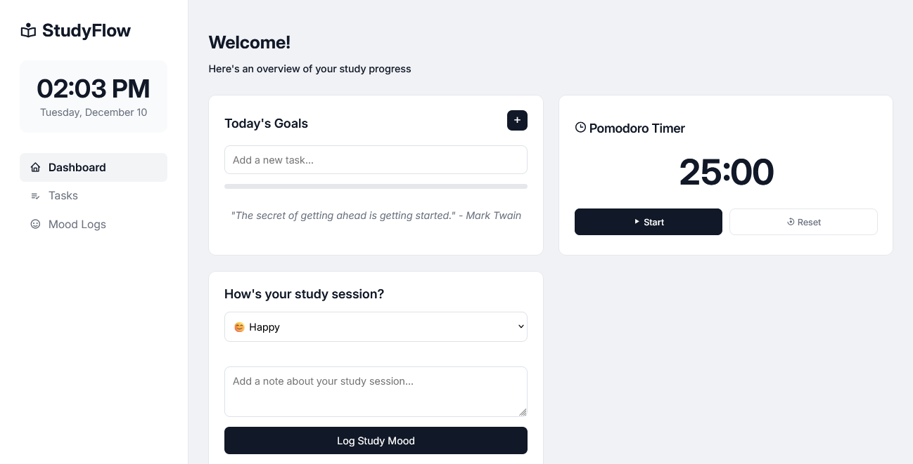

# StudyFlow
A comprehensive study companion app designed to boost productivity and track learning progress, built with Svelte.

## Features
- **Pomodoro Timer**: Customizable focus timer to enhance study efficiency using the Pomodoro Technique
- **Study Logging**: Detailed logging of study sessions, including duration, subject, and key insights
- **Todo List**: Organized task management specifically tailored for academic and learning goals
- **Persistent Storage**: All study data and tasks saved locally in your browser
- **Responsive Design**: Seamless experience across desktop and mobile devices
- **Intuitive Interface**: Clean, minimalist design to keep you focused on your learning objectives

## Tech Stack
- Svelte
- Local Storage API
- BoxIcons
- Inter Font Family

## Usage

### Try the webapp!

